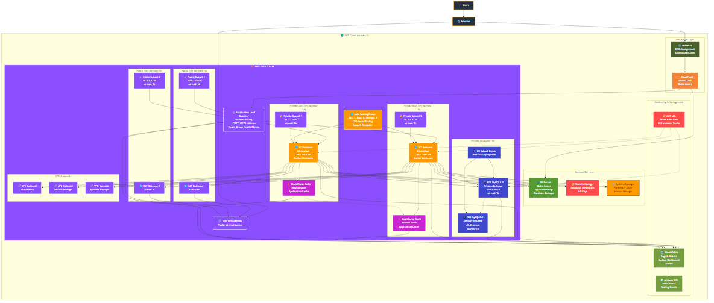

# Task Manager API - AWS Cloud Native Application


A scalable, cloud-native Task Manager API built with **.NET Core** and deployed on **AWS** using modern DevOps practices. Features auto-scaling, load balancing, and comprehensive monitoring.

## 🏗️ Solution Architecture

This project implements a **3-tier AWS architecture** with high availability, auto-scaling, and enterprise-grade security.

### **📊 Interactive Mermaid Diagram**

```mermaid
graph LR
    %% Client
    Client["👥<br/>Client"]
    
    %% AWS Cloud
    subgraph AWS["☁️ AWS Cloud"]
        
        %% Main Architecture Flow (4 steps)
        subgraph MainFlow["TaskManager AWS Architecture"]
            direction LR
            IGW["1️⃣<br/>🌐<br/>Internet<br/>Gateway"]
            ALB["2️⃣<br/>🔄<br/>Application<br/>Load Balancer"]
            EC2["3️⃣<br/>🟠<br/>Amazon EC2<br/>t3.medium<br/>Auto Scaling"]
            RDS["4️⃣<br/>🗄️<br/>Amazon RDS<br/>MySQL 8.0<br/>Multi-AZ"]
        end
        
        %% Supporting Services
        subgraph Support["Supporting Services"]
            VPC["🏗️<br/>Amazon VPC<br/>10.0.0.0/16"]
            IAM["🔐<br/>AWS IAM<br/>Roles & Policies"]
            CloudWatch["📈<br/>CloudWatch<br/>Logs & Metrics"]
            SNS["📧<br/>Amazon SNS<br/>Email Alerts"]
        end
    end
    
    %% Main data flow (solid arrows)
    Client --> IGW
    IGW --> ALB
    ALB --> EC2
    EC2 --> RDS
    
    %% Monitoring flow (solid arrows)
    EC2 --> CloudWatch
    RDS --> CloudWatch
    ALB --> CloudWatch
    CloudWatch --> SNS
    
    %% Infrastructure relationships (dotted arrows)
    VPC -.-> ALB
    VPC -.-> EC2
    VPC -.-> RDS
    IAM -.-> EC2
    IAM -.-> RDS
    
    %% AWS Service Colors (Official AWS Colors)
    classDef compute fill:#FF9900,stroke:#FFFFFF,stroke-width:2px,color:#FFFFFF
    classDef database fill:#3F48CC,stroke:#FFFFFF,stroke-width:2px,color:#FFFFFF
    classDef networking fill:#8C4FFF,stroke:#FFFFFF,stroke-width:2px,color:#FFFFFF
    classDef monitoring fill:#759C3E,stroke:#FFFFFF,stroke-width:2px,color:#FFFFFF
    classDef security fill:#FF4B4B,stroke:#FFFFFF,stroke-width:2px,color:#FFFFFF
    classDef client fill:#232F3E,stroke:#FF9900,stroke-width:2px,color:#FFFFFF
    
    class EC2 compute
    class RDS database  
    class IGW,ALB,VPC networking
    class CloudWatch,SNS monitoring
    class IAM security
    class Client client
```

### **🎨 Professional Lucidchart Diagram**

<!-- Replace this section with your Lucidchart diagram once created -->


*High-resolution AWS architecture diagram created with Lucidchart showing the complete infrastructure setup.*

**🔗 Interactive Diagram Links:**
- **Lucidchart Live Diagram**: [View Interactive Diagram](https://lucid.app/your-diagram-link) *(Replace with your actual link)*
- **Download High-Res**: [Download PNG](./images/aws-architecture-diagram.png)

---

## 🚀 Features

### ✨ **Core Functionality**
- ✅ **CRUD Operations** - Create, Read, Update, Delete tasks
- ✅ **User Authentication** - JWT-based secure authentication
- ✅ **User Registration** - Account creation and management
- ✅ **Task Management** - Priority, status, and due date tracking
- ✅ **RESTful API** - Clean API design with proper HTTP methods
- ✅ **Web Interface** - Responsive web UI for task management

### 🏗️ **AWS Cloud Features**
- ✅ **Auto Scaling** - Automatic scaling based on CPU utilization
- ✅ **Load Balancing** - Application Load Balancer with health checks
- ✅ **High Availability** - Multi-AZ deployment across 2 availability zones
- ✅ **Security** - Multi-layer security with private subnets
- ✅ **Monitoring** - CloudWatch logging and alerting
- ✅ **Database** - RDS MySQL with automated backups
- ✅ **Infrastructure as Code** - Terraform deployment scripts

### 🔧 **Technical Features**
- ✅ **Containerization** - Docker containers for consistent deployment
- ✅ **Encryption** - Data encryption at rest and in transit
- ✅ **Backup & Recovery** - Automated database backups
- ✅ **Environment Configuration** - Separate dev/staging/prod environments
- ✅ **Logging** - Centralized application and system logging
- ✅ **Health Checks** - Application and infrastructure health monitoring

## 🛠️ Tech Stack

### **Backend**
- **Framework**: .NET Core 8.0
- **Language**: C#
- **ORM**: Entity Framework Core
- **Authentication**: JWT (JSON Web Tokens)
- **API Documentation**: Swagger/OpenAPI

### **Database**
- **Primary**: Amazon RDS MySQL 8.0
- **Development**: MySQL with Docker Compose
- **Features**: Multi-AZ, Encryption, Automated Backups

### **Infrastructure**
- **Cloud Provider**: Amazon Web Services (AWS)
- **Compute**: EC2 instances (t3.medium)
- **Load Balancer**: Application Load Balancer (ALB)
- **Auto Scaling**: Auto Scaling Groups with CPU-based policies
- **Networking**: VPC, Subnets, Security Groups
- **Monitoring**: CloudWatch, SNS
- **IaC**: Terraform

### **DevOps & Tools**
- **Containerization**: Docker & Docker Compose
- **Reverse Proxy**: Nginx
- **Deployment**: Infrastructure as Code (Terraform)
- **Monitoring**: AWS CloudWatch
- **Alerts**: Amazon SNS

## 📁 Project Structure

```
TaskManagerAPI/
├── 📁 Controllers/              # API Controllers
│   ├── AccountController.cs     # User account management
│   ├── AuthController.cs        # Authentication endpoints
│   ├── TasksController.cs       # Task CRUD operations
│   └── TasksWebController.cs    # Web interface controller
├── 📁 Models/                   # Data models
│   ├── DTOs/                    # Data Transfer Objects
│   ├── TaskItem.cs              # Task entity model
│   └── User.cs                  # User entity model
├── 📁 Services/                 # Business logic layer
│   ├── IAuthService.cs          # Authentication interface
│   ├── AuthService.cs           # Authentication implementation
│   ├── ITaskService.cs          # Task service interface
│   └── TaskService.cs           # Task service implementation
├── 📁 Data/                     # Data access layer
│   └── TaskManagerDbContext.cs  # Entity Framework context
├── 📁 Views/                    # MVC Views
│   ├── Account/                 # Account views
│   ├── Home/                    # Home page views
│   └── TasksWeb/                # Task management views
├── 📁 aws-infrastructure/       # AWS deployment
│   ├── terraform/               # Terraform IaC scripts
│   ├── docker-compose.yml       # Local development
│   └── nginx.conf              # Nginx configuration
├── 📁 Middleware/              # Custom middleware
├── 📄 Dockerfile              # Container configuration
├── 📄 Program.cs              # Application entry point
└── 📄 TaskManagerAPI.csproj   # Project configuration
```

## ⚡ Quick Start

### **Prerequisites**
- [.NET 8.0 SDK](https://dotnet.microsoft.com/download)
- [Docker Desktop](https://www.docker.com/products/docker-desktop)
- [AWS CLI](https://aws.amazon.com/cli/) (for deployment)
- [Terraform](https://www.terraform.io/downloads.html) (for infrastructure)

### **1. Clone the Repository**
```bash
git clone https://github.com/osamayesh/TaskManager-WebApp-AWS-AutoScaling-ALB.git
cd TaskManager-WebApp-AWS-AutoScaling-ALB
```

### **2. Local Development Setup**
   ```bash
# Start MySQL database and API with Docker Compose
cd aws-infrastructure
docker-compose up -d

# The application will be available at:
# - API: http://localhost:5000
# - Web UI: http://localhost:80
```

### **3. AWS Deployment**
   ```bash
# Navigate to Terraform directory
cd aws-infrastructure/terraform

# Copy and configure variables
cp terraform.tfvars.example terraform.tfvars
# Edit terraform.tfvars with your AWS settings

# Initialize and deploy
terraform init
terraform plan
terraform apply
```

## 🔧 Configuration

### **Environment Variables**
   ```bash
# Database Configuration
ConnectionStrings__DefaultConnection="Server=mysql;Database=TaskManagerDB_Dev;User=root;Password=yourpassword;"

# JWT Configuration
JWT__Key="your-super-secret-jwt-key-here"
JWT__Issuer="TaskManagerAPI"
JWT__Audience="TaskManagerAPI"
JWT__ExpiryInMinutes="60"

# Environment
ASPNETCORE_ENVIRONMENT="Production"
```

### **Terraform Variables**
```hcl
# terraform.tfvars
aws_region = "us-east-1"
environment = "production"
key_pair_name = "your-ec2-key-pair"
db_password = "your-secure-db-password"
alert_email = "your-email@example.com"
```

## 📚 API Documentation

### **Authentication Endpoints**
```http
POST /api/auth/register
POST /api/auth/login
```

### **Task Management Endpoints**
```http
GET    /api/tasks              # Get all tasks
GET    /api/tasks/{id}         # Get task by ID
POST   /api/tasks              # Create new task
PUT    /api/tasks/{id}         # Update task
DELETE /api/tasks/{id}         # Delete task
```

### **Sample API Requests**

#### **Register User**
```bash
curl -X POST http://localhost:5000/api/auth/register \
  -H "Content-Type: application/json" \
  -d '{
    "username": "john_doe",
    "email": "john@example.com",
    "password": "SecurePassword123!"
  }'
```

#### **Create Task**
```bash
curl -X POST http://localhost:5000/api/tasks \
  -H "Content-Type: application/json" \
  -H "Authorization: Bearer YOUR_JWT_TOKEN" \
  -d '{
    "title": "Complete project documentation",
    "description": "Write comprehensive README and API docs",
    "priority": "High",
    "status": "Pending",
    "dueDate": "2024-02-15T18:00:00Z"
  }'
```

## 🚀 Deployment Guide

### **Local Development**
1. **Start Services**: `docker-compose up -d`
2. **Access Application**: Navigate to `http://localhost:80`
3. **API Testing**: Use `http://localhost:5000/swagger`

### **AWS Production Deployment**

#### **Step 1: Prerequisites**
   ```bash
# Install required tools
aws configure  # Configure AWS credentials
terraform --version  # Verify Terraform installation
   ```

#### **Step 2: Deploy Infrastructure**
   ```bash
   cd aws-infrastructure/terraform
cp terraform.tfvars.example terraform.tfvars

# Edit terraform.tfvars with your configuration
   terraform init
   terraform plan
   terraform apply
   ```

#### **Step 3: Access Application**
```bash
# Get the load balancer URL from Terraform output
terraform output application_load_balancer_dns
```

### **Monitoring & Maintenance**
- **CloudWatch Logs**: `/aws/ec2/taskmanager`
- **Metrics**: CPU, Memory, Database performance
- **Alerts**: Email notifications via SNS
- **Auto Scaling**: Automatic scaling based on CPU utilization

## 📊 AWS Services Architecture

### **🌐 Core AWS Services (Main Data Flow)**

| Step | Service | Icon | Function | Details |
|------|---------|------|----------|---------|
| **1️⃣** | **Internet Gateway** | 🌐 | Internet Access | Entry point for external traffic |
| **2️⃣** | **Application Load Balancer** | 🔄 | Load Distribution | HTTP/HTTPS traffic routing & health checks |
| **3️⃣** | **Amazon EC2** | 🟠 | Compute & Auto Scaling | t3.medium instances with .NET Core API |
| **4️⃣** | **Amazon RDS** | 🗄️ | Database | MySQL 8.0 with Multi-AZ deployment |

### **🛠️ Supporting AWS Services**

| Service | Icon | Category | Purpose |
|---------|------|----------|---------|
| **Amazon VPC** | 🏗️ | Networking | Virtual network with public/private subnets |
| **AWS IAM** | 🔐 | Security | Identity & access management for services |
| **CloudWatch** | 📈 | Monitoring | Centralized logging, metrics & alarms |
| **Amazon SNS** | 📨 | Notifications | Email alerts for scaling & health events |

### **🏗️ Infrastructure Features**

✅ **Auto Scaling**: 1-5 EC2 instances based on CPU utilization  
✅ **High Availability**: Multi-AZ deployment for RDS and load balancing  
✅ **Security**: VPC isolation, Security Groups, and IAM roles  
✅ **Monitoring**: CloudWatch metrics with SNS notifications  
✅ **Encryption**: Data encryption at rest for RDS  
✅ **Backup**: Automated database backups with 7-day retention

## 🔍 Monitoring & Troubleshooting

### **Health Checks**
- **Application**: `/health` endpoint
- **Load Balancer**: HTTP 200 response check
- **Database**: Connection and query performance

### **Logs Location**
```bash
# Application logs
/aws/ec2/taskmanager

# System logs
/var/log/cloud-init.log
/var/log/docker.log
```

### **Common Issues**
1. **Database Connection**: Check security groups and connection strings
2. **Auto Scaling**: Verify CloudWatch agent installation
3. **Load Balancer**: Check target group health status

## 🤝 Contributing

1. **Fork** the repository
2. **Create** a feature branch (`git checkout -b feature/amazing-feature`)
3. **Commit** your changes (`git commit -m 'Add amazing feature'`)
4. **Push** to the branch (`git push origin feature/amazing-feature`)
5. **Open** a Pull Request

### **Development Guidelines**
- Follow .NET naming conventions
- Write unit tests for new features
- Update documentation for API changes
- Ensure Docker builds successfully

## 📝 License

This project is licensed under the **MIT License** - see the [LICENSE](LICENSE) file for details.

## 🙏 Acknowledgments

- **AWS** for providing excellent cloud services
- **.NET Core** community for the robust framework
- **Terraform** for Infrastructure as Code capabilities
- **Docker** for containerization platform

## 📞 Support

- **Issues**: [GitHub Issues](https://github.com/osamayesh/TaskManager-WebApp-AWS-AutoScaling-ALB/issues)
- **Documentation**: This README and inline code comments
- **Email**: [Contact](mailto:your-email@example.com)

---

⭐ **Star this repository** if you find it useful!

---

**Built with ❤️ by [Osama Yesh](https://github.com/osamayesh)** 