# Task Manager API - Complete Multi-Tier AWS Architecture

## 🏗️ Architecture Overview

This project implements a **scalable, highly available Task Manager API** using AWS cloud services with a comprehensive **multi-tier architecture pattern** across multiple availability zones in the **us-east-1 (N. Virginia)** region.

## 🌐 Complete Infrastructure Coverage

### 🌍 **AWS Region: us-east-1**
✅ **Region**: us-east-1 (N. Virginia)  
✅ **Multi-AZ**: True - spans across availability zones us-east-1a and us-east-1b  
✅ **High Availability**: Cross-AZ redundancy for all critical components  

### 🌐 **Network Architecture - VPC: 10.0.0.0/16**

#### **Public Subnets** (Internet-facing)
✅ **Public Subnet 1**: 10.0.1.0/24 (us-east-1a) - ALB, NAT Gateway  
✅ **Public Subnet 2**: 10.0.2.0/24 (us-east-1b) - ALB, NAT Gateway  

#### **Private Subnets** (Application & Database Tiers)
✅ **Private Subnet 1**: 10.0.3.0/24 (us-east-1a) - EC2, ElastiCache  
✅ **Private Subnet 2**: 10.0.4.0/24 (us-east-1b) - EC2, ElastiCache  

## 🎯 Multi-Tier Architecture Diagram

```mermaid
graph TB
    %% Users and Internet
    Users["👥 Users"]
    Internet["🌐 Internet"]
    
    subgraph "🌍 AWS Cloud (us-east-1)"
        
        %% DNS and CDN Layer
        subgraph "DNS & CDN Layer"
            Route53["🌐 Route 53<br/>DNS Management<br/>taskmanager.com"]
            CloudFront["⚡ CloudFront<br/>Global CDN<br/>Static Assets"]
        end
        
        %% Regional Services
        subgraph "Regional Services"
            S3["🪣 S3 Bucket<br/>Static Assets<br/>Application Logs<br/>Database Backups"]
            SecretsManager["🔐 Secrets Manager<br/>Database Credentials<br/>API Keys"]
            SystemsManager["⚙️ Systems Manager<br/>Parameter Store<br/>Session Manager"]
        end
        
        %% VPC Network
        subgraph VPC["🏗️ VPC: 10.0.0.0/16"]
            
            %% Internet Gateway
            IGW["🌐 Internet Gateway<br/>Public Internet Access"]
            
            %% Public Tier - us-east-1a
            subgraph "Public Tier (us-east-1a)"
                PublicSubnet1["📡 Public Subnet 1<br/>10.0.1.0/24<br/>us-east-1a"]
                NAT1["🔄 NAT Gateway 1<br/>Elastic IP"]
            end
            
            %% Public Tier - us-east-1b  
            subgraph "Public Tier (us-east-1b)"
                PublicSubnet2["📡 Public Subnet 2<br/>10.0.2.0/24<br/>us-east-1b"]
                NAT2["🔄 NAT Gateway 2<br/>Elastic IP"]
            end
            
            %% Load Balancer
            ALB["⚖️ Application Load Balancer<br/>Internet-facing<br/>HTTP/HTTPS Listener<br/>Target Group Health Checks"]
            
            %% Application Tier - us-east-1a
            subgraph "Private App Tier (us-east-1a)"
                PrivateSubnet1["🔒 Private Subnet 1<br/>10.0.3.0/24<br/>us-east-1a"]
                EC2_1a["🖥️ EC2 Instance<br/>t3.medium<br/>.NET Core API<br/>Docker Container"]
                ElastiCache1["⚡ ElastiCache Redis<br/>Session Store<br/>Application Cache"]
            end
            
            %% Application Tier - us-east-1b
            subgraph "Private App Tier (us-east-1b)"
                PrivateSubnet2["🔒 Private Subnet 2<br/>10.0.4.0/24<br/>us-east-1b"]
                EC2_1b["🖥️ EC2 Instance<br/>t3.medium<br/>.NET Core API<br/>Docker Container"]
                ElastiCache2["⚡ ElastiCache Redis<br/>Session Store<br/>Application Cache"]
            end
            
            %% Auto Scaling Group
            ASG["🔄 Auto Scaling Group<br/>Min: 1, Max: 5, Desired: 2<br/>CPU-based Scaling<br/>Launch Template"]
            
            %% Database Tier
            subgraph "Private Database Tier"
                DBSubnetGroup["🗄️ DB Subnet Group<br/>Multi-AZ Deployment"]
                RDS_Primary["🗄️ RDS MySQL 8.0<br/>Primary Instance<br/>db.t3.micro<br/>us-east-1a"]
                RDS_Standby["🗄️ RDS MySQL 8.0<br/>Standby Instance<br/>db.t3.micro<br/>us-east-1b"]
            end
            
            %% VPC Endpoints
            subgraph "VPC Endpoints"
                VPCEndpoint_S3["🔗 VPC Endpoint<br/>S3 Gateway"]
                VPCEndpoint_SM["🔗 VPC Endpoint<br/>Secrets Manager"]
                VPCEndpoint_SSM["🔗 VPC Endpoint<br/>Systems Manager"]
            end
            
        end
        
        %% Monitoring and Management
        subgraph "Monitoring & Management"
            CloudWatch["📊 CloudWatch<br/>Logs & Metrics<br/>Custom Dashboards<br/>Alarms"]
            SNS["📧 Amazon SNS<br/>Email Alerts<br/>Scaling Events"]
            IAM["🔐 AWS IAM<br/>Roles & Policies<br/>EC2 Instance Profile"]
        end
        
    end
    
    %% User Flow
    Users --> Internet
    Internet --> Route53
    Route53 --> CloudFront
    CloudFront --> ALB
    
    %% Network Flow
    Internet --> IGW
    IGW --> ALB
    ALB --> EC2_1a
    ALB --> EC2_1b
    
    %% Database Connections
    EC2_1a --> RDS_Primary
    EC2_1b --> RDS_Primary
    RDS_Primary -.-> RDS_Standby
    
    %% Cache Connections  
    EC2_1a --> ElastiCache1
    EC2_1b --> ElastiCache2
    ElastiCache1 -.-> ElastiCache2
    
    %% NAT Gateway for Private Subnet Internet Access
    EC2_1a --> NAT1
    EC2_1b --> NAT2
    NAT1 --> IGW
    NAT2 --> IGW
    
    %% Auto Scaling
    ASG --> EC2_1a
    ASG --> EC2_1b
    
    %% Static Assets
    CloudFront --> S3
    EC2_1a --> S3
    EC2_1b --> S3
    
    %% Secrets and Configuration
    EC2_1a --> SecretsManager
    EC2_1b --> SecretsManager
    EC2_1a --> SystemsManager
    EC2_1b --> SystemsManager
    
    %% VPC Endpoints
    EC2_1a --> VPCEndpoint_S3
    EC2_1b --> VPCEndpoint_S3
    EC2_1a --> VPCEndpoint_SM
    EC2_1b --> VPCEndpoint_SM
    EC2_1a --> VPCEndpoint_SSM
    EC2_1b --> VPCEndpoint_SSM
    
    %% Monitoring
    EC2_1a --> CloudWatch
    EC2_1b --> CloudWatch
    RDS_Primary --> CloudWatch
    ALB --> CloudWatch
    ElastiCache1 --> CloudWatch
    ElastiCache2 --> CloudWatch
    CloudWatch --> SNS
    
    %% Security and Access
    IAM -.-> EC2_1a
    IAM -.-> EC2_1b
    IAM -.-> RDS_Primary
    
    %% Network Positioning
    PublicSubnet1 --> ALB
    PublicSubnet2 --> ALB
    PrivateSubnet1 --> EC2_1a
    PrivateSubnet2 --> EC2_1b
    DBSubnetGroup --> RDS_Primary
    DBSubnetGroup --> RDS_Standby
    
    %% AWS Service Colors
    classDef compute fill:#FF9900,stroke:#FFFFFF,stroke-width:2px,color:#FFFFFF
    classDef database fill:#3F48CC,stroke:#FFFFFF,stroke-width:2px,color:#FFFFFF
    classDef networking fill:#8C4FFF,stroke:#FFFFFF,stroke-width:2px,color:#FFFFFF
    classDef storage fill:#569A31,stroke:#FFFFFF,stroke-width:2px,color:#FFFFFF
    classDef security fill:#FF4B4B,stroke:#FFFFFF,stroke-width:2px,color:#FFFFFF
    classDef monitoring fill:#759C3E,stroke:#FFFFFF,stroke-width:2px,color:#FFFFFF
    classDef cache fill:#C925D1,stroke:#FFFFFF,stroke-width:2px,color:#FFFFFF
    classDef cdn fill:#F58536,stroke:#FFFFFF,stroke-width:2px,color:#FFFFFF
    classDef dns fill:#4B612C,stroke:#FFFFFF,stroke-width:2px,color:#FFFFFF
    classDef management fill:#FF9900,stroke:#000000,stroke-width:2px,color:#000000
    classDef client fill:#232F3E,stroke:#FF9900,stroke-width:2px,color:#FFFFFF
    
    %% Apply Styles
    class EC2_1a,EC2_1b,ASG compute
    class RDS_Primary,RDS_Standby,DBSubnetGroup database
    class IGW,ALB,NAT1,NAT2,VPC,PublicSubnet1,PublicSubnet2,PrivateSubnet1,PrivateSubnet2,VPCEndpoint_S3,VPCEndpoint_SM,VPCEndpoint_SSM networking
    class S3 storage
    class IAM,SecretsManager security
    class CloudWatch,SNS monitoring
    class ElastiCache1,ElastiCache2 cache
    class CloudFront cdn
    class Route53 dns
    class SystemsManager management
    class Users,Internet client
```



## 🏗️ Infrastructure Components Breakdown

### 🌐 **Networking Layer**
| Component | Configuration | Purpose |
|-----------|---------------|---------|
| **VPC** | 10.0.0.0/16 | Custom Virtual Private Cloud |
| **Internet Gateway** | Single IGW | Internet connectivity for public resources |
| **NAT Gateways** | 2 NAT Gateways with Elastic IPs | Outbound internet access for private subnets |
| **Route Tables** | Public & Private routes | Traffic routing configuration |
| **Public Subnets** | 10.0.1.0/24, 10.0.2.0/24 | Internet-facing resources |
| **Private Subnets** | 10.0.3.0/24, 10.0.4.0/24 | Application and database tiers |

### ⚖️ **Load Balancing & Auto Scaling**
| Component | Configuration | Purpose |
|-----------|---------------|---------|
| **Application Load Balancer** | Internet-facing, Multi-AZ | HTTP/HTTPS traffic distribution |
| **Target Groups** | Health checks, sticky sessions | Traffic routing to healthy instances |
| **Auto Scaling Group** | Min: 1, Max: 5, Desired: 2 | Dynamic horizontal scaling |
| **Launch Template** | t3.medium, Docker, user data | EC2 instance configuration |
| **Scaling Policies** | CPU-based triggers | Automatic scale up/down |

### 💻 **Compute Layer**
| Component | Configuration | Purpose |
|-----------|---------------|---------|
| **EC2 Instances** | t3.medium | .NET Core API hosting |
| **Docker Containers** | Containerized deployment | Application isolation and portability |
| **Multi-AZ Deployment** | Instances across us-east-1a/1b | High availability and fault tolerance |
| **IAM Instance Profile** | Secure AWS service access | Permissions for CloudWatch, S3, etc. |

### 🗄️ **Database Layer**
| Component | Configuration | Purpose |
|-----------|---------------|---------|
| **RDS MySQL 8.0** | db.t3.micro, Multi-AZ | Managed relational database |
| **Primary Instance** | us-east-1a | Active database server |
| **Standby Instance** | us-east-1b | Automatic failover capability |
| **DB Subnet Group** | Cross-AZ private subnets | Database isolation |
| **Automated Backups** | 7-day retention | Data protection |
| **Encryption** | Encryption at rest | Data security |

### ⚡ **Caching Layer** (Enhanced)
| Component | Configuration | Purpose |
|-----------|---------------|---------|
| **ElastiCache Redis** | Cross-AZ deployment | Session management and caching |
| **Cache Clusters** | Redundant clusters | High availability caching |
| **Session Store** | Redis-based sessions | Stateless application design |

### 🌐 **CDN & DNS** (Enhanced)
| Component | Configuration | Purpose |
|-----------|---------------|---------|
| **CloudFront** | Global CDN distribution | Static asset delivery |
| **Route 53** | DNS management | Domain routing and health checks |
| **S3 Bucket** | Static assets, logs, backups | Content storage and archival |

### 🔒 **Security Layer**
| Component | Configuration | Purpose |
|-----------|---------------|---------|
| **Security Groups** | Multi-layer firewall rules | Network-level security |
| **AWS Secrets Manager** | Database credentials, API keys | Secure credential management |
| **IAM Roles & Policies** | Least privilege access | Service permissions |
| **VPC Endpoints** | S3, Secrets Manager, Systems Manager | Secure AWS service access |
| **Private Subnets** | No direct internet access | Application isolation |

### 📊 **Monitoring & Management**
| Component | Configuration | Purpose |
|-----------|---------------|---------|
| **CloudWatch** | Logs, metrics, dashboards | Comprehensive monitoring |
| **CloudWatch Alarms** | CPU, memory, health checks | Proactive alerting |
| **SNS Topics** | Email notifications | Alert delivery |
| **Systems Manager** | Parameter Store, Session Manager | Configuration and access management |
| **VPC Flow Logs** | Network traffic monitoring | Security and troubleshooting |

## 🚀 **Enhanced Features & Capabilities**

### ✅ **Core Infrastructure**
- **High Availability**: Multi-AZ deployment across us-east-1a and us-east-1b
- **Auto Scaling**: CPU-based horizontal scaling (1-5 instances)
- **Load Balancing**: Application Load Balancer with health checks
- **Security**: Multi-layer security with private subnets and security groups
- **Monitoring**: Comprehensive CloudWatch monitoring and SNS alerting

### ✅ **Enhanced Capabilities**
- **CDN**: CloudFront for global content delivery
- **DNS Management**: Route 53 for domain routing
- **Caching**: ElastiCache Redis for session management
- **Secret Management**: AWS Secrets Manager for credentials
- **Configuration Management**: Systems Manager Parameter Store
- **Secure Connectivity**: VPC Endpoints for AWS services
- **Backup & Storage**: S3 for static assets and automated backups

### ✅ **Operational Excellence**
- **Infrastructure as Code**: Complete Terraform deployment
- **Automated Deployments**: CI/CD pipeline ready
- **Security Best Practices**: Least privilege IAM, encryption
- **Cost Optimization**: Right-sized instances and auto-scaling
- **Disaster Recovery**: Multi-AZ with automatic failover

## 🎯 **Traffic Flow Architecture**

### **User Request Flow**
1. **User** → **Route 53** (DNS Resolution)
2. **Route 53** → **CloudFront** (CDN Edge Location)
3. **CloudFront** → **Application Load Balancer** (Regional)
4. **ALB** → **EC2 Instances** (Health-checked targets)
5. **EC2** → **ElastiCache** (Session/Cache lookup)
6. **EC2** → **RDS MySQL** (Database operations)
7. **EC2** → **S3** (Static assets via VPC Endpoint)

### **Security & Access Flow**
- **Private Subnets**: All application and database components
- **NAT Gateways**: Outbound internet access for updates
- **VPC Endpoints**: Secure AWS service communication
- **Secrets Manager**: Secure credential retrieval
- **Systems Manager**: Secure instance management

## 🛠️ **Deployment & Management**

### **Prerequisites**
- AWS CLI configured with appropriate permissions
- Terraform >= 1.0 installed
- Docker for containerized deployment

### **Quick Deployment**
```bash
# Navigate to infrastructure directory
cd aws-infrastructure/terraform/

# Initialize Terraform
terraform init

# Plan deployment
terraform plan

# Deploy infrastructure
terraform apply -auto-approve
```

### **Post-Deployment Configuration**
1. **Route 53**: Configure custom domain
2. **CloudFront**: Set up CDN distribution
3. **Secrets Manager**: Store database credentials
4. **S3**: Configure static asset bucket
5. **ElastiCache**: Set up Redis clusters

## 📈 **Monitoring & Alerting**

### **CloudWatch Dashboards**
- **Application Metrics**: CPU, Memory, Request Count
- **Database Metrics**: Connections, Query Performance
- **Load Balancer Metrics**: Target Health, Response Times
- **Auto Scaling Metrics**: Scaling Events, Instance Health

### **Automated Alerts**
- **High CPU Utilization**: Scale up trigger
- **Low CPU Utilization**: Scale down trigger
- **Database Connection Issues**: RDS failover alerts
- **Load Balancer Health**: Target failure notifications

## 🚀 **Getting Started**

1. **Configure Variables**: Update `terraform.tfvars` with your settings
2. **Deploy Infrastructure**: Run Terraform apply
3. **Configure DNS**: Point your domain to ALB
4. **Deploy Application**: Push Docker images to ECR
5. **Monitor**: Access CloudWatch dashboards

For detailed deployment instructions, see the [deployment documentation](./aws-infrastructure/README.md).

---

**Architecture Status**: ✅ Production Ready | 🌍 Multi-Region Capable | 🔄 Auto-Scaling | �� Security Hardened