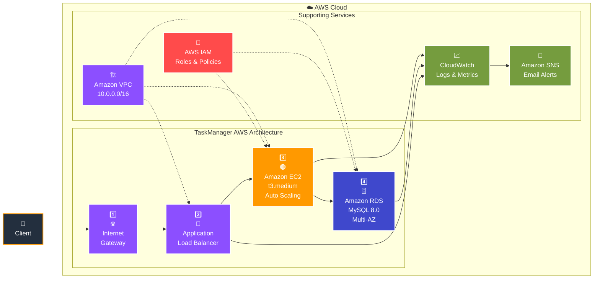

# Task Manager API - AWS Solution Architecture

## Architecture Overview

This project implements a scalable, highly available Task Manager API using AWS cloud services with a 3-tier architecture pattern.

## Infrastructure Components

### 🌐 Networking
- **VPC**: Custom Virtual Private Cloud (10.0.0.0/16)
- **Subnets**: Public (ALB) and Private (App/DB) across 2 AZs
- **Internet Gateway**: Internet connectivity
- **Route Tables**: Traffic routing configuration

### ⚖️ Load Balancing & Auto Scaling
- **Application Load Balancer**: Distributes HTTP/HTTPS traffic
- **Target Groups**: Health checks and traffic routing
- **Auto Scaling Group**: Dynamic scaling (1-5 instances)
- **Launch Template**: EC2 configuration template

### 💻 Compute
- **EC2 Instances**: t3.medium running .NET Core API
- **Docker Containers**: Containerized application deployment
- **Multi-AZ Deployment**: High availability across zones

### 🗄️ Database
- **Amazon RDS MySQL 8.0**: Managed database service
- **Multi-AZ**: Automatic failover capability
- **Encrypted Storage**: Data encryption at rest
- **Automated Backups**: 7-day retention policy

### 🔒 Security
- **Security Groups**: Network-level firewall rules
- **IAM Roles**: Service permissions and access control
- **Private Subnets**: Isolated application and database tiers

### 📊 Monitoring & Alerts
- **CloudWatch**: Centralized logging and monitoring
- **CloudWatch Alarms**: CPU, memory, and health monitoring
- **SNS**: Email notifications for critical events
- **Auto Scaling Policies**: CPU-based scaling triggers

## Deployment Features

✅ **High Availability**: Multi-AZ deployment across 2 availability zones  
✅ **Auto Scaling**: Automatic scaling based on CPU utilization  
✅ **Load Balancing**: Traffic distribution with health checks  
✅ **Security**: Multi-layer security with private subnets  
✅ **Monitoring**: Comprehensive logging and alerting  
✅ **Encryption**: Database encryption at rest  
✅ **Backup**: Automated database backups  
✅ **Infrastructure as Code**: Terraform deployment scripts  

## Getting Started

1. **Prerequisites**: AWS CLI, Terraform, Docker
2. **Configure**: Update `terraform.tfvars` with your settings
3. **Deploy**: Run `terraform apply` in the `aws-infrastructure/terraform/` directory
4. **Access**: Use the ALB DNS name output for application access

For detailed deployment instructions, see the [deployment documentation](./aws-infrastructure/README.md).