# Task Manager API - AWS Solution Architecture

## Architecture Overview

This project implements a scalable, highly available Task Manager API using AWS cloud services with a 3-tier architecture pattern.

```mermaid
graph TB
    %% External Access
    Users["👥 Users/Clients"]
    
    %% AWS Cloud Infrastructure
    subgraph AWS["☁️ AWS Cloud"]
        
        %% Internet Gateway
        IGW["🌐 Internet Gateway"]
        
        %% VPC Container
        subgraph VPC["🏢 VPC 10.0.0.0/16"]
            
            %% Public Tier
            subgraph PublicTier["🌍 PUBLIC TIER"]
                ALB["⚖️ Application Load Balancer<br/>HTTP/HTTPS Traffic<br/>Health Checks<br/>SSL Termination"]
                PubSub1["📡 Public Subnet<br/>10.0.1.0/24 AZ-A"]
                PubSub2["📡 Public Subnet<br/>10.0.2.0/24 AZ-B"]
            end
            
            %% Application Tier
            subgraph AppTier["💻 APPLICATION TIER"]
                EC2_1["🖥️ EC2 Instance 1<br/>t3.medium<br/>.NET Core API<br/>Docker Container"]
                EC2_2["🖥️ EC2 Instance 2<br/>t3.medium<br/>.NET Core API<br/>Docker Container"]
                ASG["📈 Auto Scaling Group<br/>Min: 1, Max: 5<br/>CPU-based Scaling"]
                PrivSub1["🔒 Private Subnet<br/>10.0.3.0/24 AZ-A"]
                PrivSub2["🔒 Private Subnet<br/>10.0.4.0/24 AZ-B"]
            end
            
            %% Database Tier
            subgraph DataTier["🗄️ DATABASE TIER"]
                RDS["🐬 Amazon RDS MySQL<br/>Version 8.0<br/>Multi-AZ Deployment<br/>Encrypted Storage<br/>Automated Backups"]
            end
            
        end
        
        %% Security & Monitoring
        subgraph Security["🔐 Security"]
            SG["🛡️ Security Groups<br/>Network Access Control"]
            IAM["👤 IAM Roles<br/>Service Permissions"]
        end
        
        subgraph Monitoring["📊 Monitoring"]
            CW["📈 CloudWatch<br/>Logs & Metrics"]
            SNS["📧 SNS Notifications<br/>Email Alerts"]
            Alarms["⚠️ CloudWatch Alarms<br/>CPU & Health Monitoring"]
        end
        
    end
    
    %% Connections
    Users --> IGW
    IGW --> ALB
    ALB --> EC2_1
    ALB --> EC2_2
    EC2_1 --> RDS
    EC2_2 --> RDS
    
    %% Auto Scaling
    ASG -.-> EC2_1
    ASG -.-> EC2_2
    
    %% Security
    SG -.-> ALB
    SG -.-> EC2_1
    SG -.-> EC2_2
    SG -.-> RDS
    IAM -.-> EC2_1
    IAM -.-> EC2_2
    
    %% Monitoring
    EC2_1 --> CW
    EC2_2 --> CW
    RDS --> CW
    ALB --> CW
    CW --> Alarms
    Alarms --> SNS
    Alarms --> ASG
    
    %% Network Placement
    ALB -.-> PubSub1
    ALB -.-> PubSub2
    EC2_1 -.-> PrivSub1
    EC2_2 -.-> PrivSub2
    
    %% Styling
    classDef awsService fill:#FF9900,stroke:#232F3E,stroke-width:2px,color:#FFFFFF
    classDef networkService fill:#3498DB,stroke:#2C3E50,stroke-width:2px,color:#FFFFFF
    classDef computeService fill:#27AE60,stroke:#1E8449,stroke-width:2px,color:#FFFFFF
    classDef storageService fill:#8E44AD,stroke:#6C3483,stroke-width:2px,color:#FFFFFF
    classDef securityService fill:#E74C3C,stroke:#C0392B,stroke-width:2px,color:#FFFFFF
    classDef monitoringService fill:#F39C12,stroke:#D68910,stroke-width:2px,color:#FFFFFF
    classDef userService fill:#34495E,stroke:#2C3E50,stroke-width:2px,color:#FFFFFF
    
    class AWS,VPC awsService
    class IGW,ALB,PubSub1,PubSub2,PrivSub1,PrivSub2 networkService
    class ASG,EC2_1,EC2_2 computeService
    class RDS storageService
    class Security,SG,IAM securityService
    class Monitoring,CW,SNS,Alarms monitoringService
    class Users userService
```

## Infrastructure Components

### 🌐 Networking
- **VPC**: Custom Virtual Private Cloud (10.0.0.0/16)
- **Subnets**: Public (ALB) and Private (App/DB) across 2 AZs
- **Internet Gateway**: Internet connectivity
- **Route Tables**: Traffic routing configuration

### ⚖️ Load Balancing & Auto Scaling
- **Application Load Balancer**: Distributes HTTP/HTTPS traffic
- **Target Groups**: Health checks and traffic routing
- **Auto Scaling Group**: Dynamic scaling (1-5 instances)
- **Launch Template**: EC2 configuration template

### 💻 Compute
- **EC2 Instances**: t3.medium running .NET Core API
- **Docker Containers**: Containerized application deployment
- **Multi-AZ Deployment**: High availability across zones

### 🗄️ Database
- **Amazon RDS MySQL 8.0**: Managed database service
- **Multi-AZ**: Automatic failover capability
- **Encrypted Storage**: Data encryption at rest
- **Automated Backups**: 7-day retention policy

### 🔒 Security
- **Security Groups**: Network-level firewall rules
- **IAM Roles**: Service permissions and access control
- **Private Subnets**: Isolated application and database tiers

### 📊 Monitoring & Alerts
- **CloudWatch**: Centralized logging and monitoring
- **CloudWatch Alarms**: CPU, memory, and health monitoring
- **SNS**: Email notifications for critical events
- **Auto Scaling Policies**: CPU-based scaling triggers

## Deployment Features

✅ **High Availability**: Multi-AZ deployment across 2 availability zones  
✅ **Auto Scaling**: Automatic scaling based on CPU utilization  
✅ **Load Balancing**: Traffic distribution with health checks  
✅ **Security**: Multi-layer security with private subnets  
✅ **Monitoring**: Comprehensive logging and alerting  
✅ **Encryption**: Database encryption at rest  
✅ **Backup**: Automated database backups  
✅ **Infrastructure as Code**: Terraform deployment scripts  

## Getting Started

1. **Prerequisites**: AWS CLI, Terraform, Docker
2. **Configure**: Update `terraform.tfvars` with your settings
3. **Deploy**: Run `terraform apply` in the `aws-infrastructure/terraform/` directory
4. **Access**: Use the ALB DNS name output for application access

For detailed deployment instructions, see the [deployment documentation](./aws-infrastructure/README.md). 